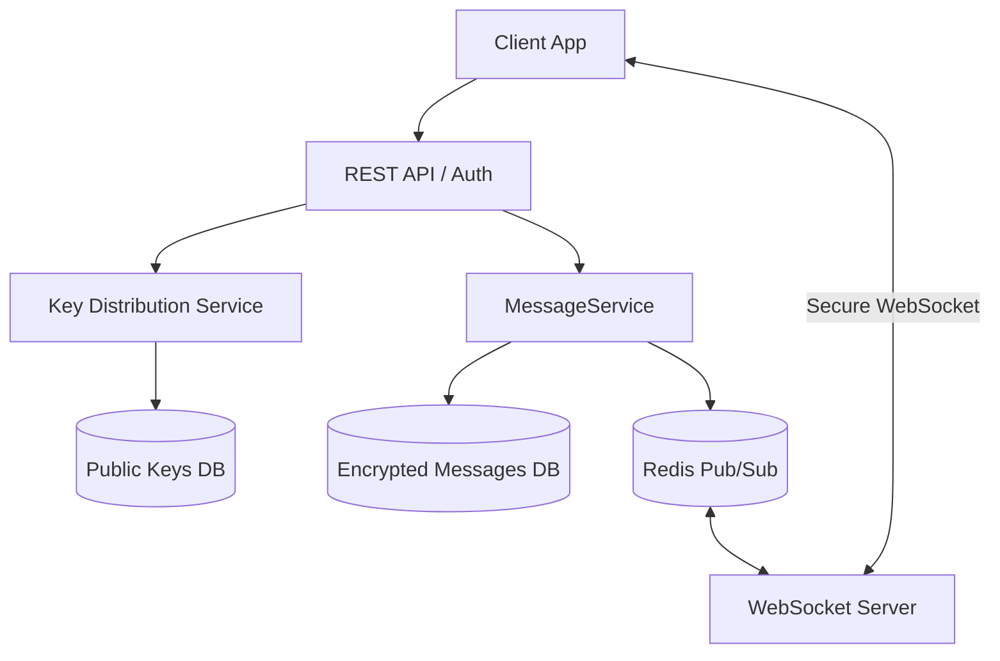
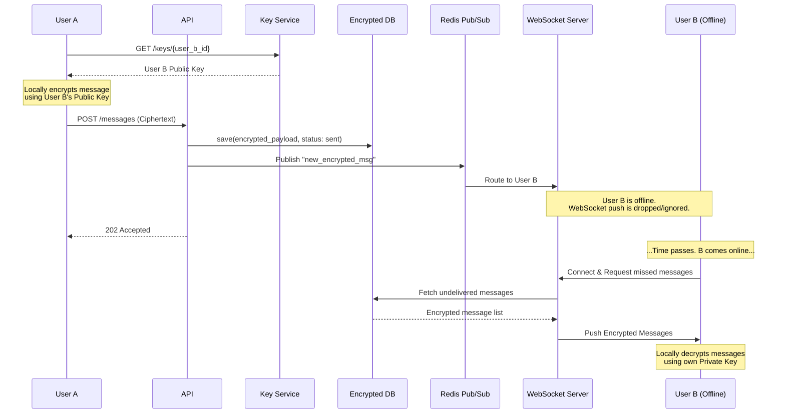
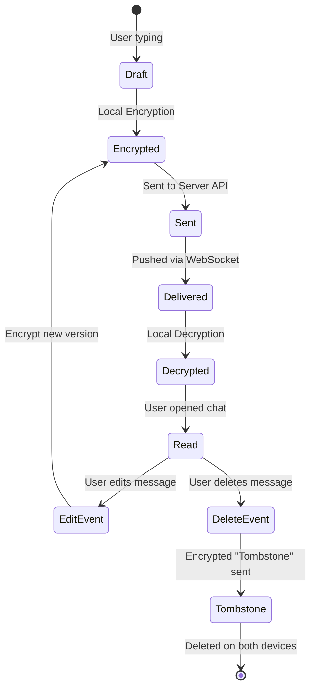

# 🧪 Laboratory Work 1: Designing a Messaging System

**Variant 8 — End-to-End Encryption (Conceptual)**

## 🧠 Context
Designing a messaging system with a focus on security and privacy (End-to-End Encryption). The main requirement: the server has no access to decryption keys and acts solely as a transit node for encrypted packets. Keys exist only on user devices.

---

## 🧱 Part 1 — Component Diagram

The architecture uses a REST API for public key exchange and WebSocket + Redis for instant delivery of encrypted packets. The server database stores messages exclusively as unreadable ciphertext.



**Component Responsibilities:**
* **REST API:** Handles registration, public key requests, and loading missed messages.
* **WebSocket Server:** Ensures instant delivery of encrypted messages to active clients.
* **Key Distribution Service:** Stores and distributes only the *public* keys of users.
* **Redis Pub/Sub:** A fast message broker for routing encrypted packets between different instances of the WebSocket server.

---

## 🔁 Part 2 — Sequence Diagram

**Scenario:** User A sends an E2E-encrypted message to User B, who is currently offline.



---

## 🔄 Part 3 — State Diagram

**Object:** `EncryptedMessage` (Message lifecycle with support for cryptographic "tombstones" for editing and deletion).



---

## 📚 Part 4 — ADR (Architecture Decision Record)

```text
# ADR-001: Use End-to-End Encryption for All Messages

## Status
Accepted

## Context
The system must guarantee that message content cannot be read by third parties, 
including server administrators or potential attackers in the event of a 
database breach.

## Decision
Implement asymmetric client-side encryption (e.g., Signal Protocol or RSA/AES 
hybrid). The server will store only metadata (sender, recipient, timestamp) 
and the ciphertext itself. Private keys are generated and stored exclusively 
in the device's secure storage.

## Alternatives
- Transport Layer Security (TLS) only, storing plain text in the DB (Rejected: 
  low privacy level, high risk).
- Symmetric encryption with keys on the server (Rejected: the server has access 
  to the keys, meaning the system is not trustless).

## Consequences
+ Maximum security and privacy.
+ Reduced legal risks when storing data on the server.
- Inability to implement server-side message search.
- Lack of server-side content moderation.
- Device loss without a key backup leads to complete loss of message history.
- ADDITIONAL: Message editing and deletion (Tombstones) are implemented via 
  sending new encrypted service events. The server does not maintain an open 
  Audit Log (to prevent metadata leakage); all state and version synchronization 
  logic resides on the client.
```
